# Richard Inda

```Programmer and Data Analyst```

I am Richard Inda, a passionate and self taught programmer and data analyst.


# 💻 Tech Stack:
                   
# 📊 GitHub Stats:




[](https://github.com/anuraghazra/github-readme-stats)
